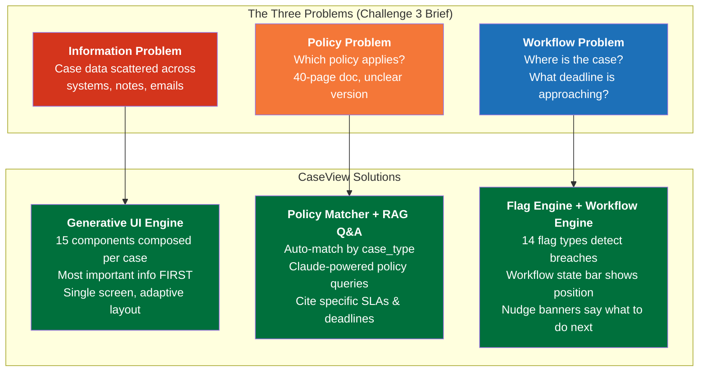
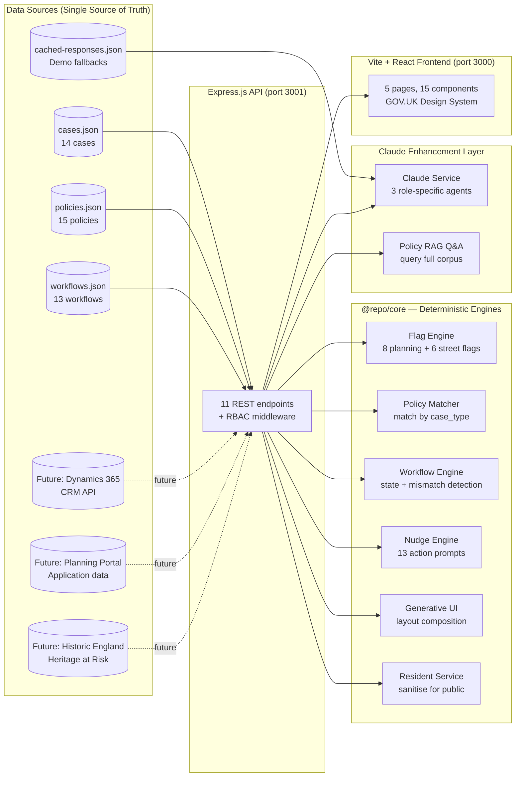
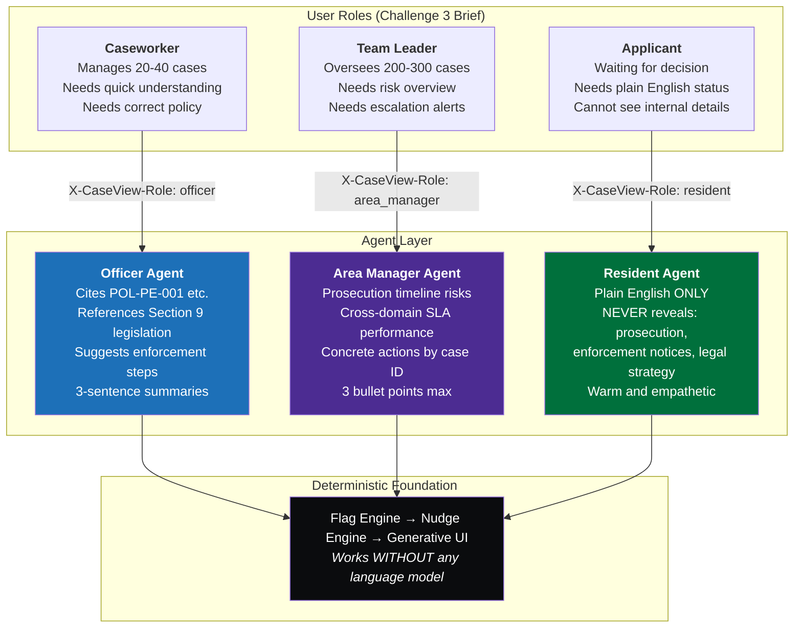
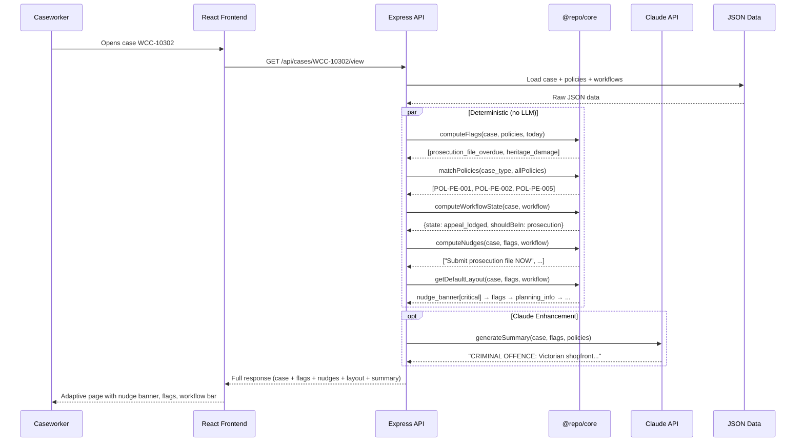
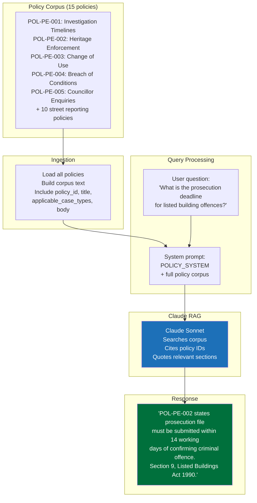
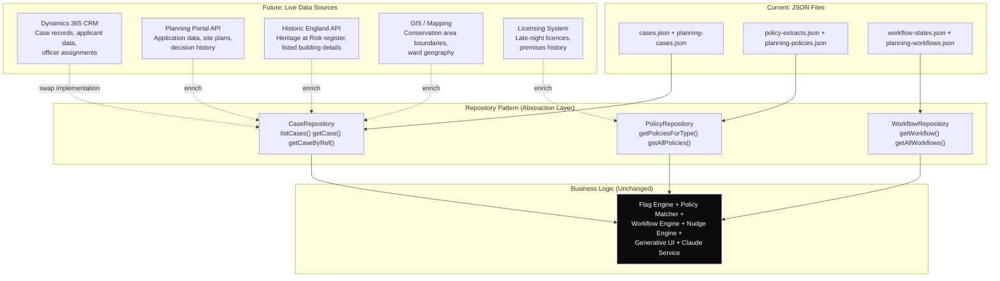
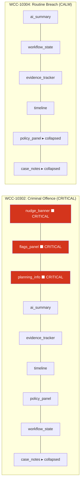
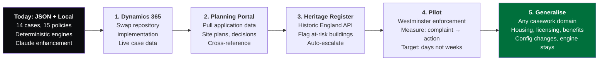

# CaseView Architecture — Challenge 3 Alignment

## How CaseView Solves the Three Problems

The Challenge 3 brief identifies three problems caseworkers face every day. CaseView addresses each with a specific engine:

## System Architecture

## Agentic Architecture — Three Agents, One System

## Data Flow — From Raw Case to Actionable View

## Policy RAG Pipeline

## Single Source of Truth — Multi-Source Data Integration

> **Key insight:** The repository pattern means switching from JSON to Dynamics 365 requires only a new `DynamicsCaseRepository` implementation. The flag engine, policy matcher, workflow engine, nudge engine, generative UI, and Claude service are completely unchanged. The business logic never knows where the data came from.

## Generative UI — Same Components, Different Composition

> Same 15 components. Different order, different emphasis, different count. The layout adapts to what matters for each case. Criminal offence? Prosecution deadline dominates. Routine? Calm and minimal.

## Challenge 3 Alignment Checklist

| Brief Criterion | Our Implementation | Evidence |
|---|---|---|
| **"Displays a case clearly"** | Generative UI engine composes 15 React components per case. Adaptive layout prioritises critical info. | WCC-10302: nudge banner + flags + planning info first. WCC-10304: calm summary first. |
| **"Surfaces the relevant policy matched by case type"** | `matchPolicies(case_type, allPolicies)` auto-matches. Policy RAG Q&A lets users query the corpus. | WCC-10302 shows POL-PE-002 with "14 working days" highlighted. Admin can ask "what's the prosecution deadline?" |
| **"Shows where the case sits in its workflow"** | `computeWorkflowState()` returns current state, days in state, and "should be in" mismatch detection. | WCC-10302: "appeal_lodged" with red dashed indicator at "prosecution". WCC-10301: 32 days in investigation. |
| **"What action is required next"** | Nudge engine transforms 14 flag types into one-click action prompts sorted by urgency. | WCC-10302: "Submit prosecution file to legal NOW" with green action button. |
| **"Flags evidence outstanding beyond policy threshold"** | Flag engine checks every case against policy SLAs. 8 planning + 6 street flag types. Each cites the specific policy ID and counts days overdue. | WCC-10302: prosecution_file_overdue (13 days, POL-PE-002 14-day threshold). WCC-10303: compliance_deadline_imminent (1 day). |
| **"Built entirely without a language model"** | Flag engine, policy matcher, workflow engine, nudge engine, generative UI — all deterministic TypeScript. Claude endpoints use cached fallbacks. | Remove `ANTHROPIC_API_KEY` and every feature still works. |
| **Three users: caseworker, team leader, applicant** | Role switcher with RBAC. Officer sees enforcement details. Team leader sees cross-domain dashboard. Applicant sees plain English — never sees prosecution/enforcement. | Role switching in header. Resident endpoint returns "We are investigating" — zero sensitive keyword leaks. |
| **"Surfacing the right information at the right moment"** | Generative UI selects and orders components by case context. Critical cases get urgency. Routine cases get calm. | Compare view: WCC-10302 vs WCC-10304 side by side proves adaptive composition. |

## What Would We Do Next

> The architecture — policy matching by case type, workflow engine, flag engine with configurable thresholds — works for ANY casework domain. Housing, licensing, environmental health, benefits. One tool, many case types. The config changes; the engine stays the same.
